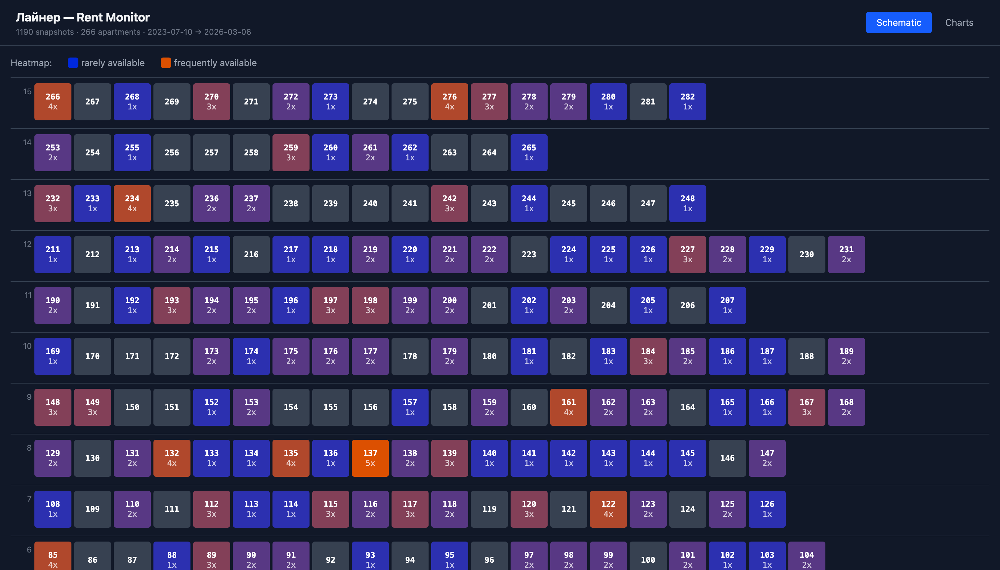

# Liner Rent Monitor

Web visualization of **three years of rental availability data** for the Liner apartment building (Лайнер, ~290 units), collected by a Telegram bot I built to find an apartment — and kept running after I moved in.

**[Live demo →](https://mplobanov.github.io/dom-visual/)**

<!-- screenshot: see "Adding a screenshot" note below the README content -->


## Backstory

Apartments in the Liner are all owned by a single rental company and turn over fast — in-demand units used to vanish within hours of being listed. I built a small Python + Telegram bot to scrape the company's portal and DM me the moment a unit hit the market. That worked: I found a place and rented it.

The bot kept running. Over the next ~three years (**Jul 2023 → Mar 2026**) it captured a longitudinal dataset on the entire building:

- **1,195** building snapshots
- **286** apartments rendered in the schematic (≈ every rentable unit in the building); **187** of them appeared as available at least once during the window
- **~2,600** per-apartment availability records — timestamp, price, booking status

This repo is the visualization layer on top of that dataset.

## What it shows

- **Building schematic** — every apartment as a cell, positioned by floor, color-coded by current and historical availability
- **Per-apartment detail** — click any unit for its full price and availability history
- **Price charts** — trends across the building and broken down by planning type (`LNR.2s.TP4.D`, etc.)

## Stack

- **Frontend:** React 19, TypeScript, Vite 6, Tailwind CSS 4, Recharts
- **Data pipeline:** Python ETL (`scripts/etl.py`) normalizes the bot's raw scrape output into a single static `public/data.json` consumed by the SPA
- **Hosting:** GitHub Pages via GitHub Actions

## Architecture

```
Telegram bot (private — hardcoded single recipient)
   │  scrapes portal, writes raw records
   ▼
Python ETL (scripts/etl.py)
   │  aggregates → public/data.json
   ▼
React + Recharts SPA (this repo)
   │  built with Vite, deployed via GitHub Actions
   ▼
GitHub Pages
```

The bot itself is single-user (hardcoded to one Telegram chat) and isn't open-sourced.
